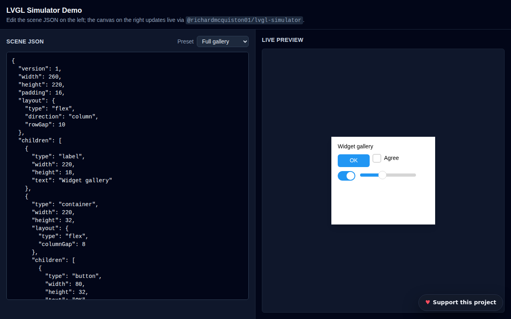

# LVGL Simulator Demo

## Overview

TypeScript based Single Page Application(SPA) demo for the
[`@richardmcquiston01/lvgl-simulator`](https://www.npmjs.com/package/@richardmcquiston01/lvgl-simulator)
package: a side-by-side JSON scene editor and live canvas preview, rendered
entirely in the browser via the published package — no server, no build step
at runtime.

## Screenshot

## Getting Started

See [`docs/GETTING_STARTED.md`](./docs/GETTING_STARTED.md) for prerequisites,
installation, usage, and a worked example.

## Accessibility

Every control — editor, toolbar, preset picker, theme toggle, help dialog,
and donate widget — is keyboard-reachable with a visible focus state and a
proper accessible name; the help dialog implements the WAI-ARIA dialog
pattern (focus moves in, Tab is trapped, Escape/backdrop closes it, focus
returns to the trigger). The live preview itself is a raw `<canvas>` the
underlying package paints pixels to directly — it has no accessible content
of its own, so its container is labelled as a visual-only region
(`role="img"` + a descriptive `aria-label`) rather than left to confuse
assistive tech with an empty name. Inspect a scene's actual structure via
the JSON editor, which is the source of truth.

Verified: WCAG AA text contrast (4.5:1) and non-text/UI-component contrast
(3:1) for every color pair in both themes; touch targets meet the 24×24px
minimum (WCAG 2.5.8) at mobile viewport sizes; landmarks, accessible names,
and heading hierarchy checked with a Playwright accessibility-tree pass.

## Development workflow

- `dev` is the integration branch. All feature work happens on a
  `feature/<slug>` branch cut from `dev`, opened as a PR back into `dev`.
- Once `dev` is validated, it's promoted to `staging` via PR for testing,
  then `staging` to `main` via PR — merging to `main` deploys to production
  on Vercel.

See [`docs/PLAN.md`](./docs/PLAN.md) for the full stage-by-stage plan.

## Buy Me a Coffee

If this app, code, or repository has helped you or someone you know, please consider donating. I appreciate any help to offset the costs of development and/or AI Credits.

[**Donate via Stripe**](https://donate.stripe.com/00w5kD3Gj1Xo9v7gVOcs800), or scan:

## License

Apache 2.0 — see [`LICENSE`](./LICENSE).

## Copyright

(c)2026 Richard McQuiston. All rights reserved.
